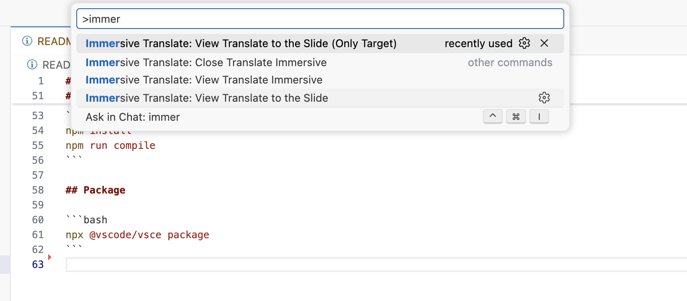
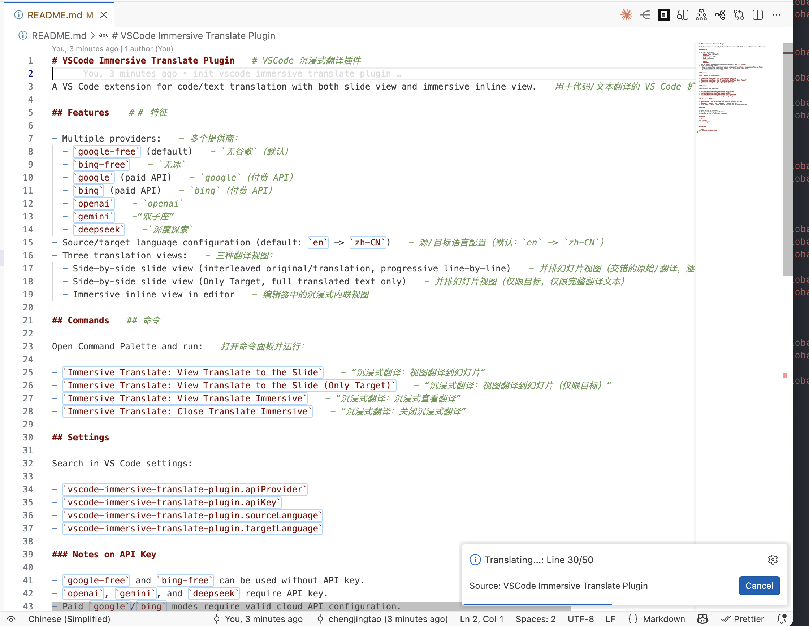
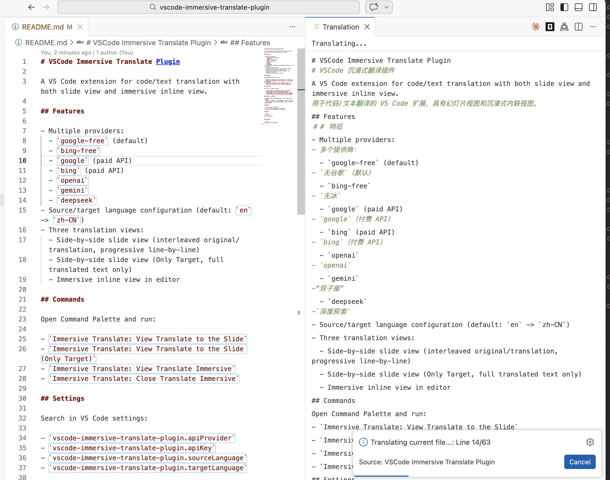
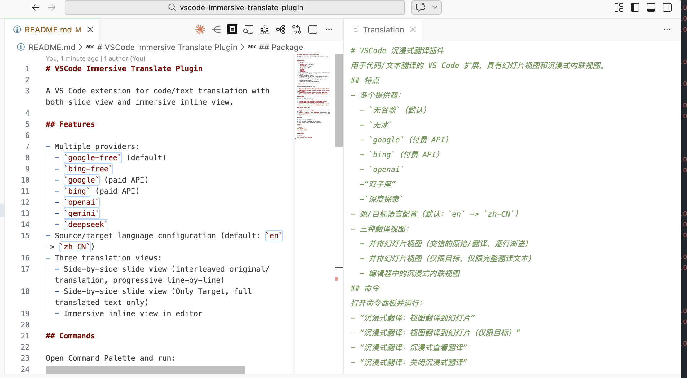
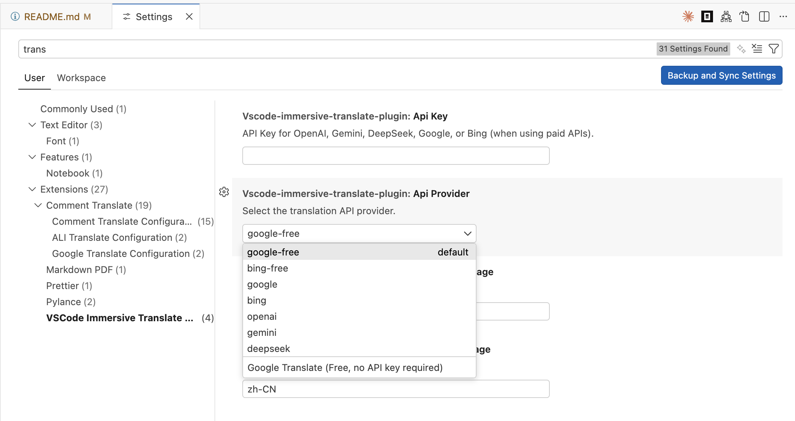

# VSCode Immersive Translate Plugin

A VS Code extension for code/text translation with both slide view and immersive inline view.

## Features

- Multiple providers:
  - `google-free` (default)
  - `bing-free`
  - `google` (paid API)
  - `bing` (paid API)
  - `openai`
  - `gemini`
  - `deepseek`
- Source/target language configuration (default: `en` -> `zh-CN`)
- Three translation views:
  - Side-by-side slide view (interleaved original/translation, progressive line-by-line)
  - Side-by-side slide view (Only Target, full translated text only)
  - Immersive inline view in editor

### Feature Overview
**command list**


**translate in-line**


**translate in slide**


**translate in slide only target**


**configuration**


## Commands

Open Command Palette and run:

- `Immersive Translate: View Translate to the Slide`
- `Immersive Translate: View Translate to the Slide (Only Target)`
- `Immersive Translate: View Translate Immersive`
- `Immersive Translate: Close Translate Immersive`

## Settings

Search in VS Code settings:

- `vscode-immersive-translate-plugin.apiProvider`
- `vscode-immersive-translate-plugin.apiKey`
- `vscode-immersive-translate-plugin.sourceLanguage`
- `vscode-immersive-translate-plugin.targetLanguage`

### Notes on API Key

- `google-free` and `bing-free` can be used without API key.
- `openai`, `gemini`, and `deepseek` require API key.
- Paid `google`/`bing` modes require valid cloud API configuration.

## Usage

1. Open a file in VS Code.
2. Set provider/language in Settings.
3. Run one of the translation commands.

## Build

```bash
npm install
npm run compile
```

## Package

```bash
npx @vscode/vsce package
```
